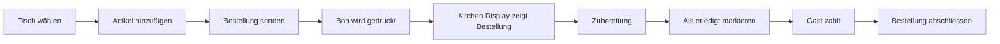

# Kassensystem Übersicht

Das Kassensystem ermöglicht die professionelle Verwaltung von Bestellungen bei Vereinsanlässen wie dem Dorffest oder der Fasnacht.

## System-Komponenten

| Komponente | URL | Beschreibung |
|------------|-----|--------------|
| **Kasse (Frontend)** | [order.fwv-raura.ch](https://order.fwv-raura.ch) | Hauptanwendung für Bestellaufnahme |
| **Kitchen Display** | [kitchen.fwv-raura.ch](https://kitchen.fwv-raura.ch) | Echtzeit-Anzeige für Küche/Bar |
| **IP-Registrierung** | [register.fwv-raura.ch](https://register.fwv-raura.ch) | Gerät für Zugriff freischalten |
| **Cloud-Kasse** | [order.fwv-raura.ch](https://order.fwv-raura.ch) | Backup-System in der Cloud |

## Architektur

### Lokales System (Raspberry Pi)
- Läuft unabhängig vom Internet
- Schnelle Reaktionszeiten
- Direkter Druckeranschluss
- Automatische Cloud-Synchronisation

### Cloud-System
- Backup bei Internet-Ausfall des lokalen Systems
- Zugriff von überall
- Bestellungen werden mit lokalem System synchronisiert

## Hauptfunktionen

### Bestellverwaltung
- Tischbasierte Bestellungen (1-99) oder Take-Away (Tisch 0)
- Artikel aus dem verknüpften Inventar-System
- Nachbestellungen zu offenen Tischen
- Bestellnotizen und Sonderwünsche
- Stornierung einzelner Positionen
- Bestellung abschliessen mit Zahlungsart

### Zahlungsarten
| Zahlungsart | Beschreibung | Integration |
|-------------|--------------|-------------|
| **Bar** | Barzahlung | Manuell |
| **Karte** | Kartenzahlung | SumUp Terminal |
| **TWINT** | TWINT-Zahlung | RaiseNow QR-Code |

### Drucker-Integration
- **ESC/POS Bonddrucker** (z.B. Epson TM-m30III)
- **Mehrere Stationen:**
  - Bar-Drucker (Getränke)
  - Küchen-Drucker (Speisen)
  - Kassen-Drucker (Quittungen)
- Automatischer Druck bei Bestellaufgabe
- Manueller Nachdruck möglich

### Echtzeit-Synchronisation
- WebSocket-Verbindung zwischen allen Komponenten
- Kitchen Display zeigt Bestellungen sofort
- Cloud-Sync alle 30 Sekunden

## Typischer Workflow

### Schritt-für-Schritt

1. **Tisch auswählen** - Tischnummer eingeben oder Tisch 0 für Take-Away
2. **Artikel hinzufügen** - Aus Kategorien oder Suche wählen, Menge anpassen
3. **Notizen hinzufügen** - Sonderwünsche, Allergien etc.
4. **Bestellung aufgeben** - Button "Bestellen" drücken
5. **Bon wird gedruckt** - Je nach Artikel an Bar und/oder Küche
6. **Nachbestellen** - Gleicher Tisch, weitere Artikel hinzufügen
7. **Abschliessen** - Zahlungsart wählen, Tisch freigeben

## Integration mit Inventar

Das Kassensystem ist direkt mit dem Inventar-System verbunden:

- **Artikelstamm:** Alle verkäuflichen Artikel kommen aus dem Inventar
- **Kategorien:** Kategorien werden übernommen (z.B. Getränke, Speisen)
- **Preise:** Verkaufspreise aus dem Inventar
- **Bilder:** Artikelbilder für einfache Auswahl
- **Lagerbestand:** Wird bei Verkauf automatisch reduziert

## Statistiken & Berichte

### Live-Statistiken
- Aktueller Tagesumsatz
- Offene Bestellungen
- Meistverkaufte Artikel
- Umsatz nach Zahlungsart

### Tagesbericht
Am Ende des Tages:
1. Öffne Einstellungen
2. Klicke auf "Tagesbericht senden"
3. Bericht wird per E-Mail an eingeloggte Person gesendet

Der Bericht enthält:
- Gesamtumsatz
- Aufschlüsselung nach Zahlungsart
- Verkaufte Artikel mit Mengen
- Zeitraum (erste bis letzte Bestellung)

## Zugriffskontrolle

### IP-Whitelist
Das System ist durch eine IP-Whitelist geschützt:
- Nur freigeschaltete Geräte können zugreifen
- Selbstregistrierung mit Admin-PIN möglich
- 24h-Freischaltung oder permanent (durch Admin)

### Authentifizierung
- **Vorstand-Login:** Für Einstellungen und Admin-Funktionen
- **Kassen-Login:** Für normale Bestellaufnahme (optional)

## Offline-Fähigkeit

Das lokale System auf dem Raspberry Pi:
- Funktioniert ohne Internetverbindung
- Speichert Bestellungen lokal
- Synchronisiert automatisch wenn Internet wieder verfügbar
- Drucker funktionieren unabhängig vom Internet

## Systemvoraussetzungen

### Hardware
- Raspberry Pi 4 (empfohlen) oder vergleichbar
- ESC/POS-kompatibler Bonddrucker
- Netzwerkverbindung (LAN empfohlen)
- Optional: Tablet/Smartphone für Bestellaufnahme

### Software
- Docker und Docker Compose
- Node.js 18+ (falls ohne Docker)
- Moderner Browser (Chrome, Firefox, Safari)

## Schnellstart für Anlässe

### Vor dem Anlass
1. Inventar prüfen und auffüllen
2. Drucker testen (Einstellungen → Testdruck)
3. IP-Whitelist konfigurieren
4. Kitchen Display auf Tablets einrichten

### Während des Anlasses
1. System starten / Container hochfahren
2. Auf allen Geräten einloggen
3. Kitchen Display Ton aktivieren (wichtig!)
4. Bestellungen aufnehmen

### Nach dem Anlass
1. Alle offenen Bestellungen abschliessen
2. Tagesbericht generieren und senden
3. System ordnungsgemäss herunterfahren
